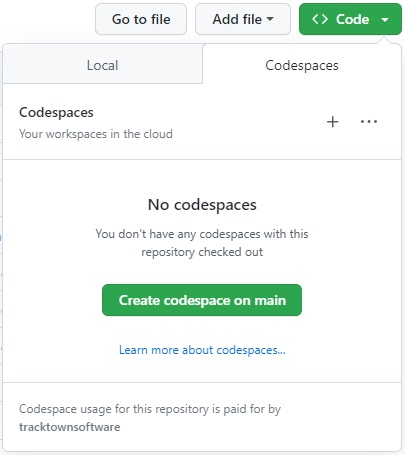
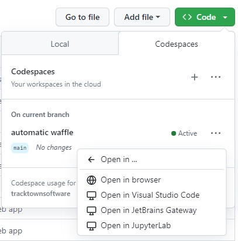

# Options to view and run SpreadsheetGear sample code in Visual Studio Code: #

## Open a Github Codespace in a browser based VSCode editor (no install required) ##
1. [Github Codespaces Overview](https://docs.github.com/en/codespaces/overview)
2. Log into your Github account
3. Open this repository and click the green "Code" button
4. Select the Codespaces tab. If you don't see this tab (see image below) then enable the CodeSpaces feature in your Github settings. 
5. Click the "Create Codespaces on Main" button 

    

6. You will see your new Codespace for this repo load into a browser based Visual Studio Code editor. Wait a few more minutes as required VSCode extensions are downloaded and installed. You will not see this setup delay when opening an existing Codespace.
7. Keep in mind Github free accounts only allow 2 Codespaces. You can delete and create Codespaces for repos as needed.  

## Open a Github Codespace in your local VSCode editor (no other install required) ##
1. Once you have an existing Github Codespace (see previous option), you can choose to open it in the browser or your local installed VSCode editor.

    

## Clone this repo and use its DevContainer configuration in your local VSCode editor (Docker Desktop install required to host the DevContainer) ##
1. [VSCode DevContainer Overview](https://code.visualstudio.com/docs/devcontainers/create-dev-container)
2. You will need to install Docker Desktop on your local machine to host the Docker DevContainer.
## Clone this repo and use your local Visual Studio Code editor with all requirements installed. ##
