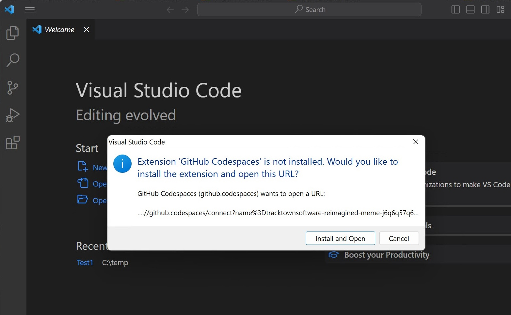

# Options to view and run SpreadsheetGear sample code in Visual Studio Code #

## Open a Github Codespace for this repo in a browser based VSCode editor (no install required) ##
1. [Github Codespaces Overview](https://docs.github.com/en/codespaces/overview)
2. Open this repository and click the green "Code" button
3. Select the Codespaces tab. If you don't see this tab (see image below), then make sure the CodeSpaces feature is enabled in your Github account settings. 
4. Click the "Create Codespaces on Main" button. Configuration information found in this repo's [.devcontainer folder](../.devcontainer) will be used to create a Docker DevContainer.

    

6. You will see your new Codespace for this repo load into a browser based Visual Studio Code editor. Wait a few more minutes as required VSCode extensions are downloaded and installed. You will not see this setup delay when opening an existing Codespace.
7. Keep in mind Github free accounts only allow 2 Codespaces. You can delete and create Codespaces for repos as needed.  

## Open a Github Codespace for this repo in your local VSCode editor (only requires the VSCode extension Github Codespaces) ##
1. Once you have an existing Github Codespace (see previous option), you can choose to open it in your local installed VSCode editor.

    

2. If not already installed, you will be prompted to install extension *Github Codespaces* into your local VSCode.

    

## Clone this repo and use its DevContainer configuration in your local VSCode editor (Docker Desktop required to host the DevContainer) ##
1. [VSCode DevContainer Overview](https://code.visualstudio.com/docs/devcontainers/create-dev-container)
2. You will need to [install Docker Desktop](https://docs.docker.com/get-docker/) on your local machine to host the Docker DevContainer.
3. Clone this repo into your target folder.
## Clone this repo and use your local Visual Studio Code editor with all requirements installed. ##
